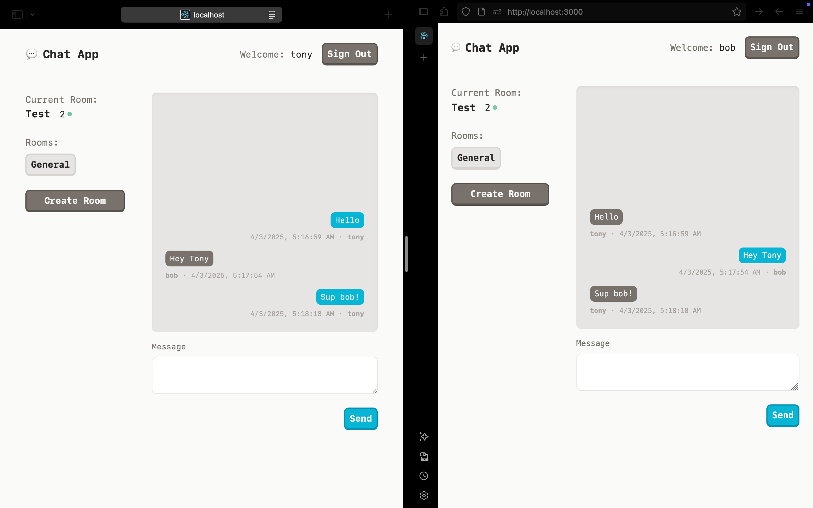

# REAL-TIME-CHAT-APPLICATION

## 🏢 Internship Details

- **Company:** CODTECH IT Solutions  

- **Name:** DOMA BALA SUNDARAM

- **Intern ID:** :CT04DH2304

- **Domain:** Front-End Development  

- **Duration:** 4 Weeks

- **Mentor:** Neela Santhosh

# 🧩 Chat App – A Real-Time Messaging Application

## Overview

The **Chat App** is a simple yet functional real-time messaging application built using modern web technologies including **React**, **TypeScript**, **Socket.IO**, and **Express**. Designed for ease of use and extensibility, this project demonstrates how real-time communication can be achieved using WebSockets within a full-stack JavaScript application.

This project is intended as an educational and foundational reference for developers interested in learning real-time frontend-backend communication using **Socket.IO**, while maintaining a clean and scalable codebase using **TypeScript** on both the client and server sides.

---

## 📸 Project Preview

The chat interface is lightweight, responsive, and designed to work across desktop devices. This screenshot demonstrates the primary chat window as rendered on the browser.

---

## 🚀 Features

- 🔁 **Real-Time Messaging** – Instant communication between connected clients using Socket.IO.
- 🛠️ **Full TypeScript Support** – Strong type safety for both frontend and backend.
- 💬 **Clean, Minimal Interface** – Focused on functionality without UI distractions.
- ⚡ **Lightweight Backend** – Built with Node.js and Express, easy to deploy and scale.
- 🧩 **Modular Structure** – Well-organized folder structure to support future feature additions.

---

## 🧱 Technology Stack

| Layer      | Technology        |
|------------|-------------------|
| Frontend   | React (with Vite) |
| Backend    | Node.js + Express |
| Real-Time  | Socket.IO         |
| Language   | TypeScript        |
| Styling    | CSS (Basic)       |
| Build Tool | Vite              |

---

## 📂 Project Structure

chat-app/
├── client/                 # Frontend React Application
│   ├── src/
│   │   ├── components/     # React components
│   │   ├── hooks/          # Custom hooks
│   │   └── main.tsx        # App entry
│   └── package.json
├── server/                 # Backend Express Server
│   ├── src/
│   │   ├── index.ts        # Server entry with Socket.IO logic
│   └── package.json
├── screenshot.png          # Project interface preview
└── README.md               # Project documentation

## 🔐 Security & Data Persistence

This project currently does **not** implement:

* Authentication or authorization
* Persistent chat storage (e.g., databases)
* End-to-end encryption

These features can be added in future versions for production readiness.

---

## 🧩 Potential Enhancements

Here are some suggestions for extending the project:

* [ ] Add user login/registration
* [ ] Store chat history using MongoDB or PostgreSQL
* [ ] Display connected users in the room
* [ ] Add typing indicators and read receipts
* [ ] Enable chat rooms with unique URLs
* [ ] Improve UI using a framework like Tailwind CSS or Material UI

---

## 🙋‍♂️ Contributing

Contributions, issues, and feature requests are welcome!
If you have suggestions or improvements, feel free to fork the repository and submit a pull request.

---

Thank you for checking out this project!
